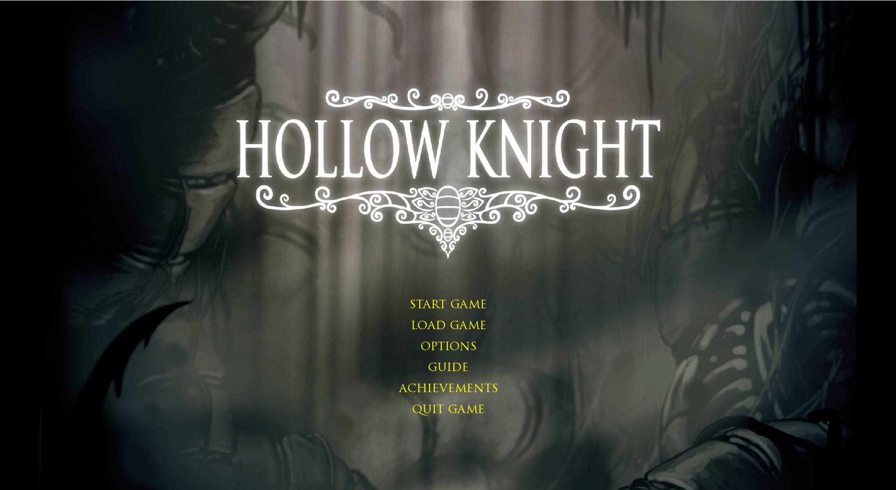
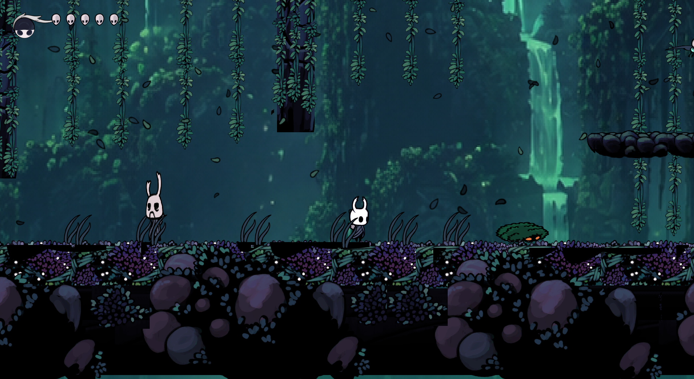
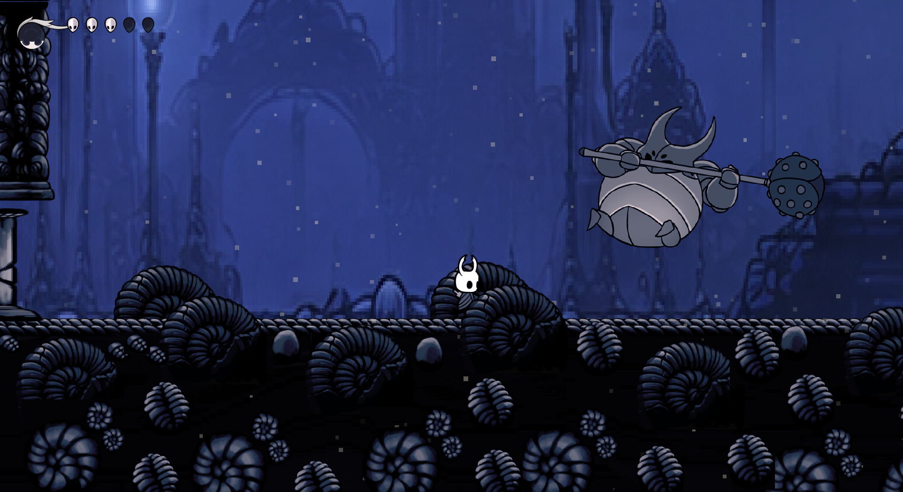

# Hollow Knight

**A 2D Metroidvania fan game inspired by Hollow Knight**

Built with **Java, LibGDX & LWJGL3**


---

## 🎮 About

**Hollow Knight** is a 2D side-scrolling Metroidvania fan game built with **Java and LibGDX**.

Explore interconnected rooms, fight enemies with the Nail, collect and equip charms, use Soul abilities, interact with NPCs, and challenge the **False Knight** in a dedicated boss arena.

The project combines platforming, combat, progression, UI, save management, achievements, and Tiled-based level design into a complete playable experience.

---

## 📸 Screenshots

### Main Menu



### Gameplay



### False Knight Boss Fight



---

## ✨ Features

### 🗺️ Exploration

* Connected rooms linked by doors
* Tiled-based environments
* Platforming and traversal
* Dash
* Wall slide and wall jump
* Environmental particles

### ⚔️ Combat

* Directional Nail attacks
* Down-slash pogo
* Soul system
* Focus healing
* Vengeful Spirit
* Howling Wraiths
* Multiple enemy types

### 💎 Charms & Progression

* Six equippable charms
* Charm notch system
* Inventory management
* Four save/profile slots
* Quick save and load
* Achievement system
* In-game achievement notifications

### 👑 Boss & NPCs

* False Knight boss encounter
* Arena lock
* Shockwave attacks
* Camera shake
* Zote NPC
* Dialogue system
* Voice lines

### 🖥️ UI & Settings

* Health and Soul HUD
* Main menu and pause menu
* Inventory interface
* In-game gameplay guide
* Music and SFX controls
* Brightness settings
* English / French UI
* Rebindable controls

---

## 🎮 Gameplay

The game follows a short adventure across two hand-crafted Tiled maps.

1. Start from the main menu and select a profile.
2. Explore the first area and encounter enemies.
3. Fight using Nail attacks and Soul abilities.
4. Talk to Zote and manage your charms.
5. Enter the boss arena.
6. Challenge the False Knight.
7. Reach the victory screen and review your run statistics.

---

## 🎯 Controls

Default bindings can be changed through **Options** where supported.

| Action                  | Key         |
| ----------------------- | ----------- |
| Move                    | `←` `→`     |
| Aim / Vertical Movement | `↑` `↓`     |
| Jump                    | `Z`         |
| Nail Attack             | `X`         |
| Dash                    | `C`         |
| Focus / Heal            | `A`         |
| Vengeful Spirit         | `F`         |
| Howling Wraiths         | `V`         |
| Inventory               | `I`         |
| Interact                | `E`         |
| Advance Dialogue        | `Enter`     |
| Pause                   | `Esc`       |
| Quick Save / Load       | `F5` / `F9` |

### Debug Controls

Hold `Left Ctrl` while using the following keys:

| Debug Action      | Key         |
| ----------------- | ----------- |
| Emergency Revive  | `Caps Lock` |
| Boss Teleport     | `B`         |
| God Mode On / Off | `G` / `H`   |
| Fill Soul         | `S`         |
| Noclip On / Off   | `Q` / `E`   |

---

## 🧩 Architecture

The codebase follows a **Model–View–Controller (MVC)** style structure under `io.github.HollowKnight`.

| Layer          | Responsibility                                                                  |
| -------------- | ------------------------------------------------------------------------------- |
| **Model**      | Knight, enemies, world, rooms, charms, saves, settings, achievements, particles |
| **View**       | Screens, renderers, HUD, dialogue, menus                                        |
| **Controller** | Input, combat, spells, boss AI, NPC interaction, save flow, events              |

### Desktop Entry Point

```text
Lwjgl3Launcher
      │
      ▼
    Main
      │
      ▼
    Game
```

---

## 🎨 Rendering

The game uses **LibGDX** and **Tiled** for its world and rendering pipeline.

* `.tmx` maps and `.tsx` tilesets
* `TmxMapLoader`
* `OrthogonalTiledMapRenderer`
* Layered rendering for background, solids, main, and foreground
* Object layers for enemies, doors, hazards, and spawn points
* Texture atlases for characters, enemies, boss, spells, NPCs, HUD, and UI
* Scene2D for menus, inventory, pause, and dialogue
* Player-follow camera
* Boss arena camera clamping
* Screen shake
* Environmental particles

---

## 🏗️ Project Structure

```text
HollowKnight/
├── assets/              # Maps, textures, atlases, audio and UI
├── core/                # Shared game logic
├── lwjgl3/              # Desktop launcher and packaging
├── gradle/              # Gradle wrapper
├── build.gradle         # Gradle build configuration
├── settings.gradle      # Gradle project settings
├── gradlew              # Gradle wrapper (Unix)
├── gradlew.bat          # Gradle wrapper (Windows)
└── README.md
```

---

## 🛠️ Technology Stack

| Technology        | Purpose              |
| ----------------- | -------------------- |
| **Java 25**       | Programming language |
| **LibGDX 1.14.2** | Game framework       |
| **LWJGL3**        | Desktop backend      |
| **Tiled**         | Level design         |
| **Gradle**        | Build system         |
| **FreeType**      | Font rendering       |

---

## 🚀 Build & Run

### Requirements

* **JDK 25**

### Download

A pre-built playable JAR is available in the project's **[Releases](../../releases)** section.

Download `HollowKnight.jar` from the latest release and run:

```bash
java -jar HollowKnight.jar
```

### Build from Source

**Windows**

```powershell
gradlew.bat lwjgl3:jar
```

**Linux / macOS**

```bash
./gradlew lwjgl3:jar
```

The runnable JAR is generated at:

```text
dist/HollowKnight.jar
```

### Run from Source

**Windows**

```powershell
gradlew.bat lwjgl3:run
```

**Linux / macOS**

```bash
./gradlew lwjgl3:run
```

### Run the Packaged Game

```bash
java -jar dist/HollowKnight.jar
```

---

## 💾 Save System

The game supports **four independent profile slots**, allowing players to maintain separate progress.

Quick save and load are available through `F5` and `F9`.

---

## 🏆 Achievements

Achievements are tracked during gameplay and displayed through in-game popup notifications.

---

## 🌐 Localization

The interface supports:

* 🇬🇧 English
* 🇫🇷 French

The language can be changed through the game's settings.

---

## 📚 In-Game Guide

A built-in guide introduces the game's main systems, including:

* Movement
* Combat
* Soul abilities
* Charms
* Boss mechanics

---

## ❤️ Credits

This project was developed as an **Academic Programming (AP) course project**.

Inspired by **Hollow Knight** by Team Cherry.

Built with **LibGDX**, **LWJGL**, and **gdx-liftoff**.

> An unofficial educational fan project inspired by Hollow Knight.

